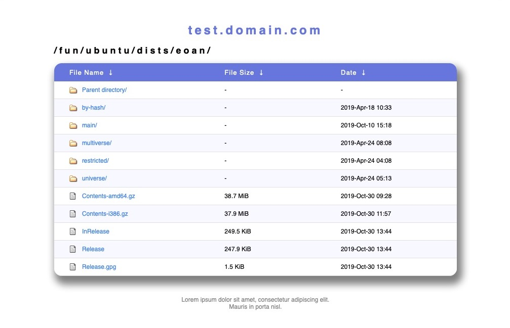

# nginx-fancyindex-hiawatha
Hiawatha theme for nginx's fancyindex plugin 



## About

The [fancyindex module](https://github.com/aperezdc/ngx-fancyindex) of
[nginx](http://nginx.org/) has the powerful capability to be customizable.
Instead of using an external application, this gives us the ability to use use
just the webservers capabilities to generate beautiful directory listings.

This theme provides a simple, flat interface based on [Hiawatha Server Index](https://www.hiawatha-webserver.org).


## Usage

1. Copy footer.html, header.html, css/style.css files into any location accessible by *nginx*.
2. Configure your vhost to use the theme's ressources for fancyindex:
    ```
    # Fancyindex
    fancyindex             on;
    fancyindex_header      "/hiawatha/header.html";
    fancyindex_footer      "/hiawatha/footer.html";
    fancyindex_show_path   off;
    fancyindex_name_length 255;
    fancyindex_exact_size  off;
    fancyindex_localtime   on;

    location /hiawatha {
        alias /srv/www/fileserver/hiawatha;
    }
    ```

## Enjoy!
